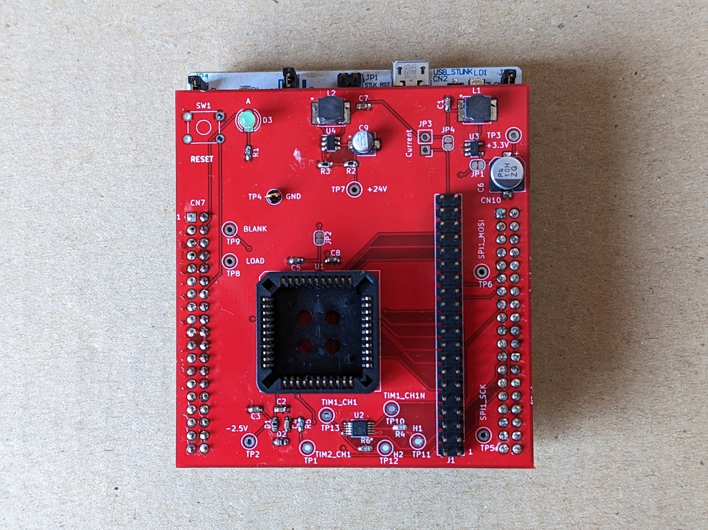

# Akashi-11
Prototype of the EL-210 mod 

## Description

This board is prototype of the [EL-210-MOD](https://github.com/suikan4github/EL-210-MOD) board. Akashi-11 is designed to mount on the 
[Nucleo G0B1RE](https://www.st.com/ja/evaluation-tools/nucleo-g0b1re.html) board and 
to be connected with the  [Akashi-10 board](https://github.com/suikan4github/Akashi-10) in EL-210. 

The battery power is supplied from the EL-210 through a ribbon cable. This power is 
boosted on the board to be a 3.3V. And supplied to Nucleo through the pin 12 and 16 of 
the CN7. To avoid an accident, the bridge SB1 on the Nucleo G0B1RE must be cut. 

Also, the NRST signal from STLINK must be cut. 

Signal assignment of Nucleo is as following : 

| Signal | GPIO Pin |
|-|-|
| KC0 | PA10 |
| KC1 | PB3 |
| KC2 | PB5 |
| KR8 | PA5 |
| KR7 | PA6 |
| KR6 | PC1 |
| KR5 | PB0 |
| KR4 | PC7 |
| KR3 | PB2 |
| KR2 | PB6 |
| KR1 | PB14 |
| KR0 | PB4 |
| SPI1_MOSI | PA12 |
| SPI1_SCK | PD8 |
| LOAD | PC10 |
| BLANK | PC12 |
| TIM1_CH1 | PA8 |
| TIM1_CH1N | PA7 |
| TIM1_CH2 | PA9 |
| EN24 | PC11 |
| STATUS | PD2 |

Refer the [EL-210-MOD](https://github.com/suikan4github/EL-210-MOD) project for details of the circuit design. 

# Gallery
